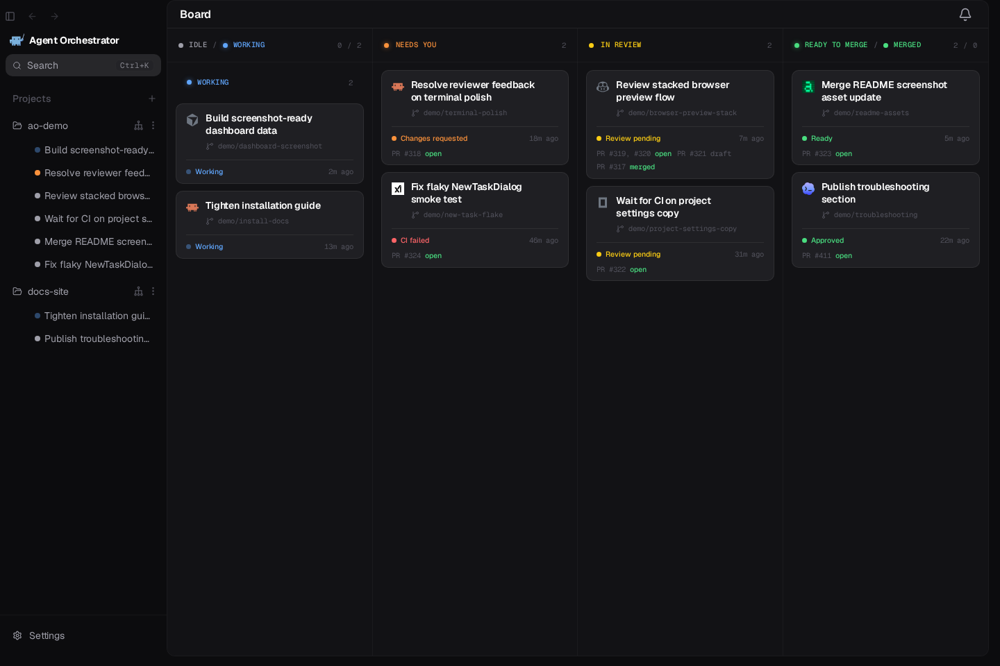

<div align="center">
  

# Hosted AO

**Agent Orchestrator, with a cloud under it.**

[](https://github.com/Untrivial-ai/agent-orchestrator)
[](https://ao.agentlab.in)
[](LICENSE)

One desktop app that runs parallel AI coding agents on your machine and on your cloud VMs, side by side, behind one account.


</div>

## What this is

[Agent Orchestrator](https://github.com/Untrivial-ai/agent-orchestrator) supervises fleets of coding agents (Claude Code, Codex, and 20+ others) in isolated worktrees on your machine. Hosted AO keeps all of that and adds the part upstream deliberately does not have: **machines that are not yours to babysit**.

Sign in once. Register a VM with a single command. Your board now shows local sessions and cloud sessions together, and an agent running on a VM in another country attaches its terminal into your desktop as if it were local.

## How it fits together

Three pieces, each with one job:

| Piece | Job |
|---|---|
| **Hosted AO desktop** (this repo) | The Electron app. Runs the local daemon, signs in to the control plane, and speaks an authenticated transport (REST, SSE, terminal WebSocket) to whichever machine you point it at. |
| **VM gateway** (`ao vm serve`, this repo) | The only public-facing process on a VM. ACME TLS, per-machine JWT verification against the control plane's JWKS, and a deny-by-default reverse proxy in front of a loopback-only daemon. |
| **Control plane** (private, [ao.agentlab.in](https://ao.agentlab.in)) | Accounts, the machine registry, and short-lived token minting. Never in the data path: your code and your terminals flow desktop-to-VM directly. |

The daemon itself never grows a public listener. That is a hard rule inherited from upstream and enforced harder here: the gateway is a separate process, the loopback daemon stays unauthenticated on 127.0.0.1, and the gateway's path allowlist decides what the outside world may ever ask.

## What the hosting layer adds

- **One account, many machines.** Google sign-in, a machine picker in the app, and unbindable machine registrations on the account page.
- **One-command VM bootstrap.** `ao setup-vm` takes a fresh Ubuntu box to a registered, TLS-serving agent machine: dependency preflight, systemd units for daemon and gateway, device-flow binding, done.
- **Real remote sessions.** Bearer-authenticated REST and SSE, cookie-authenticated terminal mux and event streams, silent token refresh. The board, the terminal, notifications, all of it works against a remote machine.
- **Clone by URL.** Point a project at a Git URL and the VM clones it; nothing needs to pre-exist on the machine.
- **Remote health.** `GET /api/v1/doctor` serves the same checks `ao doctor` runs, through the gateway, so the app can tell you a machine's harness auth is broken before you waste a session on it.
- **Perfect coexistence.** All state lives under `~/.ao/hosted`. Install Hosted AO next to a stock Agent Orchestrator and neither knows the other exists.

## Getting started

```bash
# Desktop (macOS)
npm install
cd frontend && npm install && npm run make
open "out/make/Hosted AO-"*.dmg

# A VM (Ubuntu, with a DNS name pointed at it)
ao setup-vm
```

Sign in from the app, pick your machine, spawn agents.

## Relationship to upstream

This repo is a true fork of [Untrivial-ai/agent-orchestrator](https://github.com/Untrivial-ai/agent-orchestrator) and tracks it continuously: upstream's product is merged wholesale, and the hosting layer stays deliberately thin around it. Everything upstream ships, this ships. Licensed [Apache-2.0](LICENSE), same as upstream.
